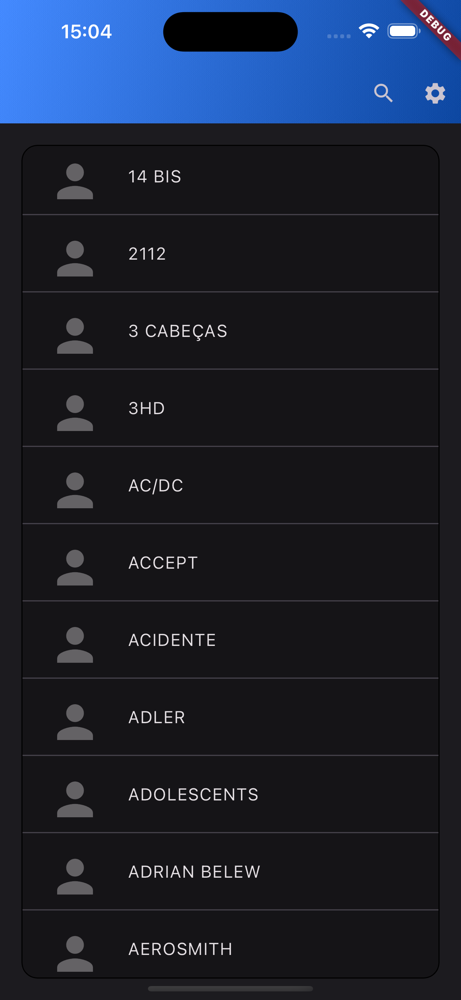
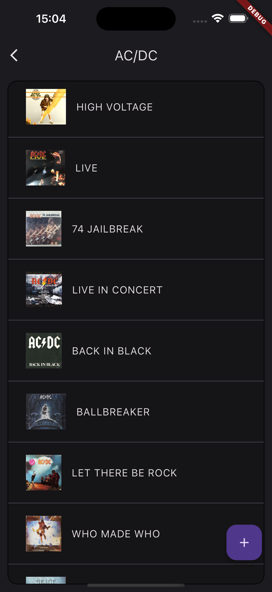
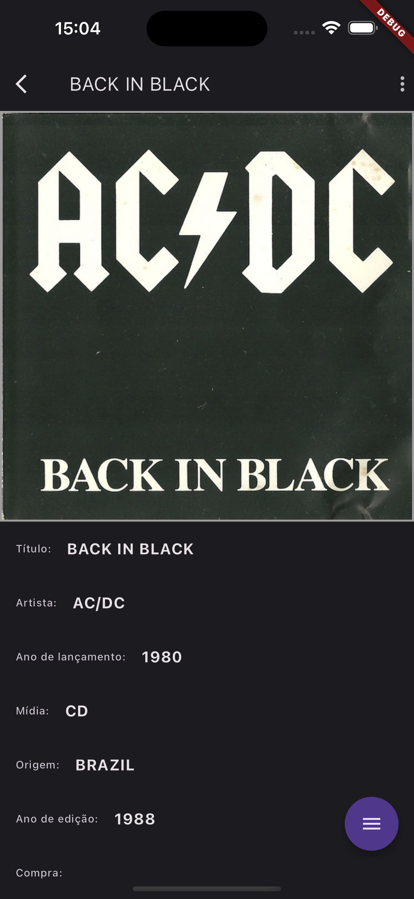

# Music Application

This is a music application built using Flutter. It allows users to manage their music collection.

## Features

- Browse and search for albuns
- Play albuns on Spotify

## Installation

1. Clone the repository:

    ```bash
    git clone https://github.com/gabrieloliveira95/music-app.git
    ```

2. Change to the project directory:

    ```bash
    cd music-app
    ```

3. Install dependencies:

    ```bash
    flutter pub get
    ```

4. Add .env file in assets folder (no client secret: the app authenticates
   the user with Authorization Code + PKCE via Auth0 Universal Login)

    ```bash
    cat > assets/.env <<'ENV'
    OAUTH_CLIENT_ID=<Auth0 NATIVE application client id>
    OAUTH_AUDIENCE=<API audience expected by the backend>
    OAUTH_DOMAIN=<tenant>.us.auth0.com
    ENV
    ```

    The backend host (`API_DOMAIN`) and the Discogs token (`DISCOGS_TOKEN`)
    are not in `.env`: they come from Auth0 custom claims (see step 5) so they
    can be changed without rebuilding. You may optionally add either to `.env`
    as a local-dev fallback, but neither is required.

5. Auth0 dashboard setup (one time)

    - Applications → Create Application → type **Native**. Use its client id
      as `OAUTH_CLIENT_ID`.
    - In the application settings, add to **Allowed Callback URLs** and
      **Allowed Logout URLs**. Both platforms use the custom scheme
      `com.gabriel.musicapp` (iOS derives it from the bundle identifier with
      `useHTTPS` off; Android sets it in `android/app/build.gradle.kts` to
      avoid App Links verification). Note the path segment differs: iOS uses
      the bundle id `com.gabriel.musicapp`, Android the applicationId
      `com.gabriel.music_app`:

      ```
      com.gabriel.musicapp://<tenant>.us.auth0.com/ios/com.gabriel.musicapp/callback,
      com.gabriel.musicapp://<tenant>.us.auth0.com/android/com.gabriel.music_app/callback
      ```

    - Make sure the user connection (e.g. Username-Password-Authentication)
      is enabled for this application.
    - For automatic token renewal, the API identified by `OAUTH_AUDIENCE`
      must have **Allow Offline Access** enabled.
    - **Config as custom claims.** So the backend host and Discogs token can
      be changed without rebuilding the app, they are read from the ID token
      instead of the bundled `.env`. To change them later you just edit the
      Action Secrets in Auth0, no rebuild. In **Actions → Library → Build
      Custom → Login** (or your existing post-login Action), add Action
      **Secrets** named `API_DOMAIN` (e.g. `api.hostname`)
      and `DISCOGS_TOKEN`, then set the claims:

      ```js
      exports.onExecutePostLogin = async (event, api) => {
        // Auth0 requires a URI-shaped namespace so custom claims never clash
        // with standard OIDC claims. It is only a label: it is never fetched
        // and can be any value. The app matches each claim by its name
        // (API_DOMAIN / DISCOGS_TOKEN), ignoring the namespace, so you can
        // change it freely.
        const namespace = 'https://music-app.claims/';
        api.idToken.setCustomClaim(
          `${namespace}API_DOMAIN`,
          event.secrets.API_DOMAIN,
        );
        api.idToken.setCustomClaim(
          `${namespace}DISCOGS_TOKEN`,
          event.secrets.DISCOGS_TOKEN,
        );
      };
      ```

      Deploy the Action and add it to the **Login** flow. Existing sessions
      keep using any `.env` fallback until the next login refreshes the token.

6. Run the application:

    ```bash
    flutter run
    ```

## Screenshots

Artists Screen            |  Artists Albuns Screeen          |  Album Details Screen
:-------------------------:|:-------------------------:| :-------------------------:
  |   | 

## Contributing

Contributions are welcome! If you find any bugs or have suggestions for new features, please open an issue or submit a pull request.

## License

This project is licensed under the [MIT License](LICENSE).

## Acknowledgements

- [Flutter](https://flutter.dev/)
- [Flutter Packages](https://pub.dev/flutter/packages)
- [Icons8](https://icons8.com/)

